::::::::::: align-right
Retourner à l'accueil [](https://vizagreste.agriculture.gouv.fr/){style="max-height: 100px; width: auto;"}

Partager la Viz (Mail) [](mailto:?subject=Regarde-ce-rapport&body=Voici-le-lien-:-https://monrapport.fr)

Partager la Viz (X) [](https://twitter.com/intent/tweet?text=Regarde-ce-rapport-!&url=https://monrapport.fr)

Partager la Viz (Facebook) [](https://www.facebook.com/sharer/sharer.php?u=https://monrapport.fr)

Explorer les données territoriales 

Pendant la navigation, appuyer pour accéder aux autres actions 

<!-- MENU 1 : Départements -->

:::::: {#menu-overlay-1 .menu-overlay}
::: {.menu-close onclick="closeMenu('menu-overlay-1')"}
✖
:::

::: {.menu-option onclick="goTo('https://vizagreste.agriculture.gouv.fr/#/indicateur/01/2020')"}
📍 01 Ain
:::

::: {.menu-option onclick="goTo('https://vizagreste.agriculture.gouv.fr/#/indicateur/02/2020')"}
📍 02 Aisne
:::
::::::

<!-- MENU 2 : Paramètres  -->

:::::: {#menu-overlay-2 .menu-overlay}
::: {.menu-close onclick="closeMenu('menu-overlay-2')"}
✖
:::

::: {.menu-option onclick="goTo('https://vizagreste.agriculture.gouv.fr/')"}
📈 Accueil
:::

::: {.menu-option onclick="goTo('mailto:?subject=Regarde-ce-rapport&body=Voici-le-lien-: https://monrapport.fr')"}
📉 Partager la Viz
:::
::::::
:::::::::::

# **Evolution du nombre d'exploitations agricoles en france**

```{=html}
<p>
  En 2020, la France 
  <span class="tooltip-container">
    <span class="tooltip-question">?</span>
    <span class="tooltip-content">
      Y compris les 5 départements d’outre-mer : Guadeloupe, Martinique, Guyane, la Réunion et Mayotte (Mayotte est recensée depuis 2020).
    </span>
  </span>
    compte <strong>416 436</strong> "exploitations agricoles" 
  <span class="tooltip-container">
    <span class="tooltip-question">?</span>
    <span class="tooltip-content">
      Unité de production agricole disposant d’une gestion courante propre et dépassant un seuil minimum de superficie - 1 ha ou 20 ares de cultures spécialisées - ou de production, estimée en cheptel ou volume.
    </span>
  </span>
  selon les résultats du dernier recensement agricole
</p>
```

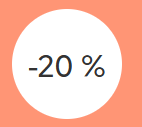 En **métropole**, elles sont **390 000**. C'est **100 000** de moins en 10 ans, soit une baisse de **20%**

:::: {.cr-section .reframe-2-2}
::: {#cr-nb_ea1}
# **Nombre d'exploitations agricoles en métropole**

{.img-fluid-custom}

<details>

<summary>ℹ️ Télécharger les données</summary>

<a href="./data-csv/nombre-d-exploitations-agricoles.csv" download style="display: block; margin-top: 0.5rem;"> 📥 Format CSV </a> <a href="./data-svg/nombre-d-exploitations-agricoles.svg" download style="display: block; margin-top: 0.5rem;"> 📥 Format SVG </a> <a href="./data-png/nombre-d-exploitations-agricoles.png" download style="display: block; margin-top: 0.5rem;"> 📥 Format PNG </a>

</details>
:::

Pour autant, l’agriculture est toujours présente dans nos paysages : la superficie agricole utilisée ne recule que de 1 % depuis 2010. @cr-nb_ea1

```{=html}
<p>
  Pour autant, l’agriculture est toujours présente dans nos paysages : la superficie agricole utilisée 
  <span class="tooltip-container">
    <span class="tooltip-question">?</span>
    <span class="tooltip-content">
      La superficie agricole utilisée (SAU) comprends les terres arables (y compris pâturages temporaires, jachères, cultures sous abri, jardins familiaux...), les surfaces toujours en herbe et les cultures permanentes (vignes, vergers...).
    </span>
  </span>
  ne recule que de 1 % depuis 2010.
</p>
```

Les exploitations se regroupent, elles sont moins nombreuses tout en travaillant un espace équivalent. Ainsi, le poids des exploitations de moins de 20 ha baisse de 43 % à 38 %. @cr-nb_ea1
::::

::::: {.cr-section .reframe-2-2}
::: {#cr-nb_ea2}
**4 fois moins d'exploitations qu'en 1970**

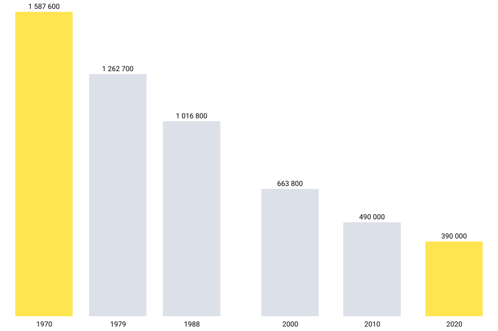{.img-fluid-custom}

<details>

<summary>ℹ️ Télécharger les données</summary>

<a href="./data-csv/nombre-d-exploitations-agricoles1.csv" download style="display: block; margin-top: 0.5rem;"> 📥 Format CSV </a> <a href="/data-svg/nombre-d-exploitations-agricoles1.svg" download style="display: block; margin-top: 0.5rem;"> 📥 Format SVG </a> <a href="./data-png/nombre-d-exploitations-agricoles1.png" download style="display: block; margin-top: 0.5rem;"> 📥 Format PNG </a>

</details>
:::

::: {#cr-nb_ea3}
**Forte concentration entre 1988 et 2000**

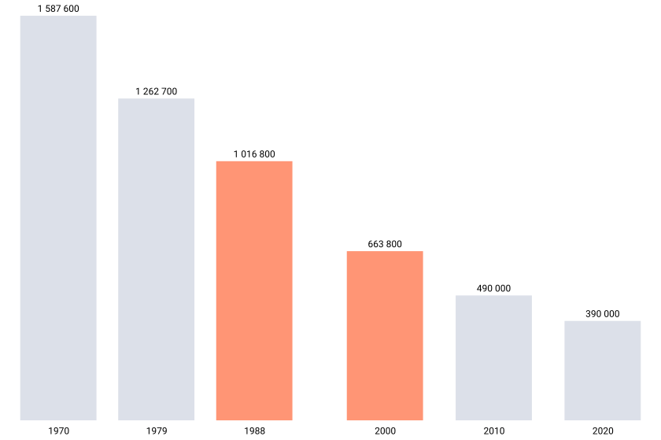{.img-fluid-custom}

<details>

<summary>ℹ️ Télécharger les données</summary>

<a href="./data-csv/nombre-d-exploitations-agricoles2.csv" download style="display: block; margin-top: 0.5rem;"> 📥 Format CSV </a> <a href="./data-svg/nombre-d-exploitations-agricoles2.svg" download style="display: block; margin-top: 0.5rem;"> 📥 Format SVG </a> <a href="./data-png/nombre-d-exploitations-agricoles.png" download style="display: block; margin-top: 0.5rem;"> 📥 Format PNG </a>

</details>
:::

De moins en moins d’exploitations : cette tendance observée au travers des recensements agricoles se poursuit : elles étaient [4 fois plus nombreuses en métropole en 1970]{.highlight-yellow}. @cr-nb_ea2

Si la baisse du nombre d’exploitations est une constante depuis 50 ans, elle a été maximale entre 1988 et 2000, avec une [chute de 350 000]{.highlight-orange} en douze ans. @cr-nb_ea3

```{=html}
<p>
  Si la baisse du nombre d’exploitations est une constante depuis 50 ans, elle a été maximale entre 1988 et 2000,
  <span class="tooltip-container">
    <span class="tooltip-question">?</span>
    <span class="tooltip-content">
      La mise en oeuvre des "quotas laitiers" et des mesures d'incitation à la retraite ont favorisé les regroupements.
    </span>
  </span>
  avec une <span class="highlight-orange">chute de 350 000</span> en douze ans.
</p>
```
:::::

# **Evolution annuelle moyenne du nombre d'exploitations**

{.img-fluid-custom .img-center}

<details>

<summary>ℹ️ Télécharger les données</summary>

<a href="./data-csv/evolution-annuelle-moyenne-du-nombre-d-exploitations.csv" download style="display: block; margin-top: 0.5rem;"> 📥 Format CSV </a> <a href="./data-svg/evolution-annuelle-moyenne-du-nombre-d-exploitations.svg" download style="display: block; margin-top: 0.5rem;"> 📥 Format SVG </a> <a href="./data-png/evolution-annuelle-moyenne-du-nombre-d-exploitations.png" download style="display: block; margin-top: 0.5rem;"> 📥 Format PNG </a>

</details>

Depuis, la baisse s'atténue progressivement. Elle s'établit à [-2.3 % par an]{.highlight-blue} sur la période 2010-2020 (contre -3 % entre 2000 et 2010)

::::::: {.cr-section .reframe-2-2}
::: {#cr-evo-nb-ea}
**Évolution du nombre d'exploitations par spécialisation**

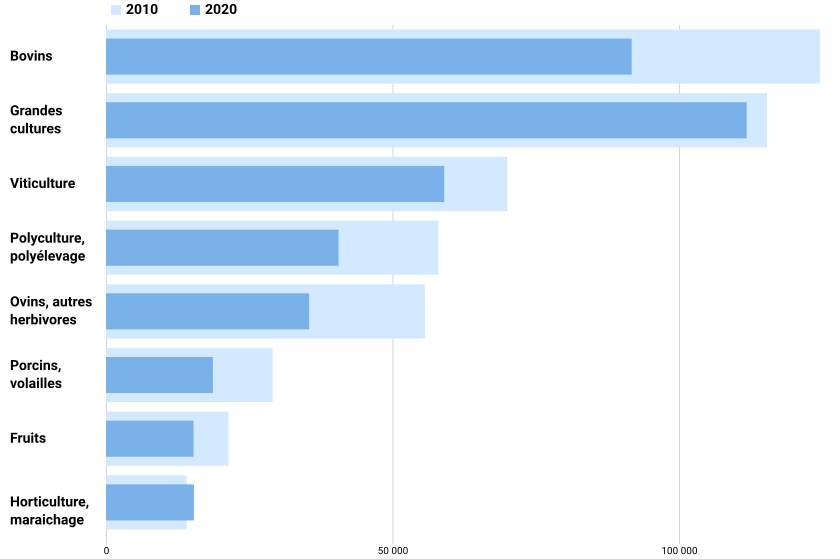{.img-fluid-custom}

<details>

<summary>ℹ️ Télécharger les données</summary>

<a href="./data-csv/evolution-du-nombre-d-exploitations-par-specialisation.csv" download style="display: block; margin-top: 0.5rem;"> 📥 Format CSV </a> <a href="./data-svg/evolution-du-nombre-d-exploitations-par-specialisation.svg" download style="display: block; margin-top: 0.5rem;"> 📥 Format SVG </a> <a href="./data-png/evolution-du-nombre-d-exploitations-par-specialisation.png" download style="display: block; margin-top: 0.5rem;"> 📥 Format PNG </a>

</details>
:::

::: {#cr-evo-nb-ea1}
**Évolution du nombre d'exploitations par spécialisation**

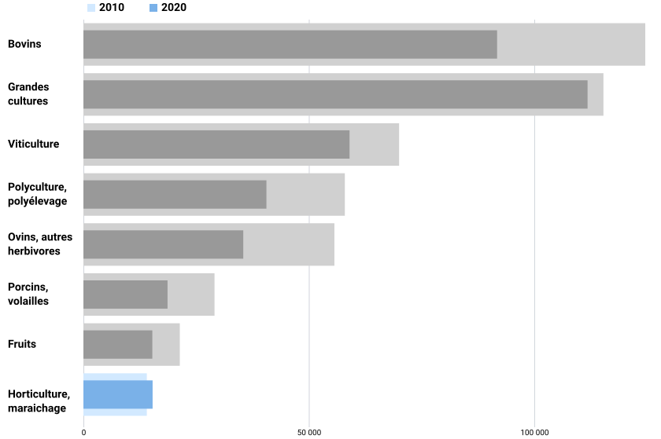{.img-fluid-custom}

<details>

<summary>ℹ️ Télécharger les données</summary>

<a href="./data-csv/evolution-du-nombre-d-exploitations-par-specialisation1.csv" download style="display: block; margin-top: 0.5rem;"> 📥 Format CSV </a> <a href="./data-svg/evolution-du-nombre-d-exploitations-par-specialisation1.svg" download style="display: block; margin-top: 0.5rem;"> 📥 Format SVG </a> <a href="./data-png/evolution-du-nombre-d-exploitations-par-specialisation1.png" download style="display: block; margin-top: 0.5rem;"> 📥 Format PNG </a>

</details>
:::

::: {#cr-evo-nb-ea2}
**Évolution du nombre d'exploitations par spécialisation**

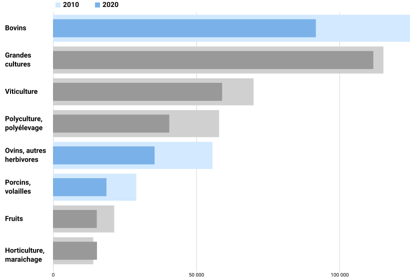{.img-fluid-custom}

<details>

<summary>ℹ️ Télécharger les données</summary>

<a href="./data-csv/evolution-du-nombre-d-exploitations-par-specialisation2.csv" download style="display: block; margin-top: 0.5rem;"> 📥 Format CSV </a> <a href="./data-svg/evolution-du-nombre-d-exploitations-par-specialisation2.svg" download style="display: block; margin-top: 0.5rem;"> 📥 Format SVG </a> <a href="./data-png/evolution-du-nombre-d-exploitations-par-specialisation2.png" download style="display: block; margin-top: 0.5rem;"> 📥 Format PNG </a>

</details>
:::

::: {#cr-evo-nb-ea3}
**Évolution du nombre d'exploitations par spécialisation**

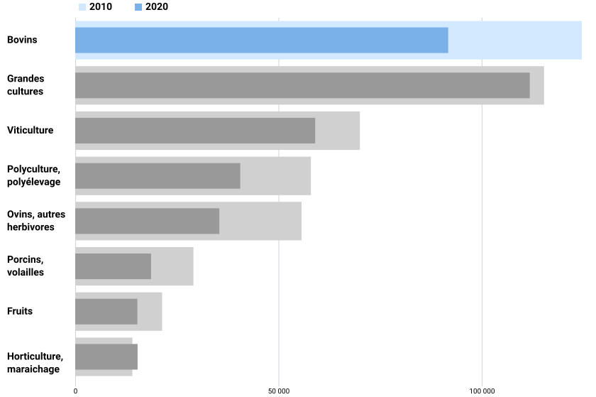{.img-fluid-custom}

<details>

<summary>ℹ️ Télécharger les données</summary>

<a href="./data-csv/evolution-du-nombre-d-exploitations-par-specialisation3.csv" download style="display: block; margin-top: 0.5rem;"> 📥 Format CSV </a> <a href="./data-svg/evolution-du-nombre-d-exploitations-par-specialisation3.svg" download style="display: block; margin-top: 0.5rem;"> 📥 Format SVG </a> <a href="./data-png/evolution-du-nombre-d-exploitations-par-specialisation3.png" download style="display: block; margin-top: 0.5rem;"> 📥 Format PNG </a>

</details>
:::

Dans presque toutes les spécialisation, le nombre d'exploitations recule entre 2010 et 2020, excepté pour ["Horticulture-maraichage"]{.highlight-lightskyblue}. @cr-evo-nb-ea1

C'est dans les exploitations spécialisées en [élevage]{.highlight_lightblue} que la baisse est la plus forte : -30 % (correspondant à -63 500 exploitations), preque les 2/3 de la diminution totale. @cr-evo-nb-ea2

[L'élevage de bovins]{.highlight-lightblue} est particulièrement concerné : -33 000 exploitations, soit -27 %. Il perd le premier range qu'il détenait en 2010, qui revient à la spécialisation "Grandes cultures". @cr-evo-nb-ea3
:::::::

# Comment se traduisent ces évolution générales dans les territoires ?

::::::::::::::: {.cr-section .reframe-2-2}
::: {#cr-carte}
**Taux d'évolution du nombre d'exploitations, 2010-2020 (en %)**

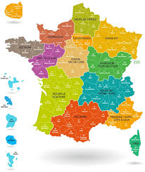{.img-fluid-custom}
:::

Dans une grande façade Ouest, le nombre d'exploitations en [Normandie, Bretagne, Pays de la Loire, et Nouvelle-Aquitaine]{.highlight-purple} par exemple, se réduit plus fortement ... @cr-carte

...que dans les [Hauts-de-France]{.highlight-purple}, l'[Île-de-France]{.highlight-purple} ou l'ancienne [Champagne-Ardenne]{.highlight-purple}. @cr-carte

Tous les territoires sont concernés par la baisse du nombre d'exploitations excepté la [Corse]{.highlight-green} et la [Guyane]{.highlight-green}, qui se distinguent par une légère augmentation. @cr-carte

À l’opposé, le nombre d'exploitations baisse le plus fortement dans trois départements de l'Est de la France métropolitaine : [Vosges]{.highlight-purple}, [Territoire-de-Belfort]{.highlight-purple} et [Alpes-Maritimes]{.highlight-purple}. @cr-carte

Dans ces départements se poursuit ces dix dernières années une tendance plus ancienne, avec une diminution plus prononcée qu’en moyenne. @cr-carte

```{r include=FALSE}
# A modifier pour bien zoomer sur les vosges
```

Les [Vosges]{.highlight-purple} comptent 1 000 exploitations de moins qu'en 2010, évolution plus forte que celle observée entre 2000 et 2010 (-4 % par an contre -3,2 %). @cr-carte

::: bubble-white
*Vosges : un tiers d'exploitations en moins entre 2010 et 2020*

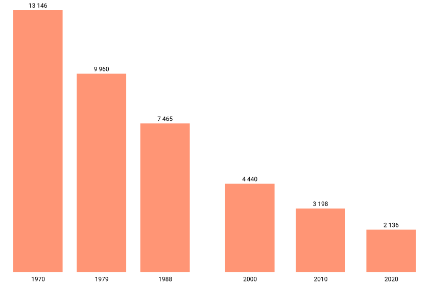

<details>

<summary>ℹ️ Télécharger les données</summary>

<a href="./data-csv/vosges-un-tiers-d-exploitations-en-moins-entre-2010-et-2020.csv" download style="display: block; margin-top: 0.5rem;"> 📥 Format CSV </a> <a href="./data-svg/vosges-un-tiers-d-exploitations-en-moins-entre-2010-et-2020.svg" download style="display: block; margin-top: 0.5rem;"> 📥 Format SVG </a> <a href="./data-png/vosges-un-tiers-d-exploitations-en-moins-entre-2010-et-2020.png" download style="display: block; margin-top: 0.5rem;"> 📥 Format PNG </a>

</details>
:::

::: bubble-white
*Comparaison : indice base 100*

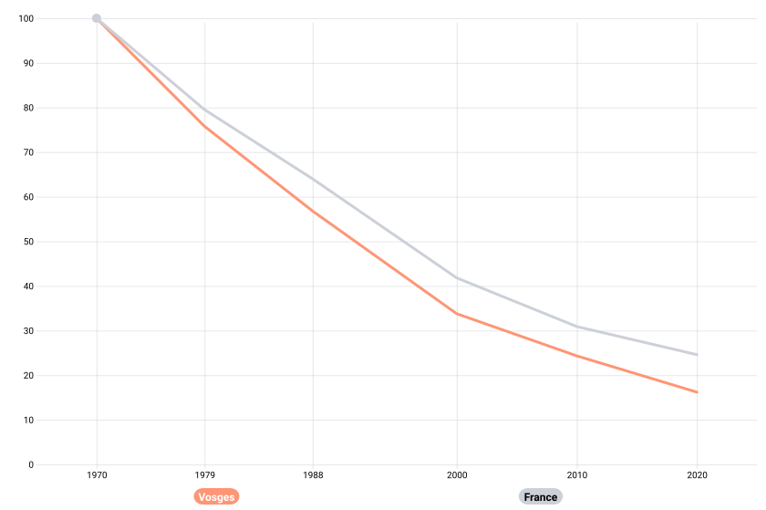

<details>

<summary>ℹ️ Télécharger les données</summary>

<a href="./data-csv/vosges-comparaison-indice-base-100.png.csv" download style="display: block; margin-top: 0.5rem;"> 📥 Format CSV </a> <a href="./data-svg/vosges-comparaison-indice-base-100.png.svg" download style="display: block; margin-top: 0.5rem;"> 📥 Format SVG </a> <a href="./data-png/vosges-comparaison-indice-base-100.png.png" download style="display: block; margin-top: 0.5rem;"> 📥 Format PNG </a>

</details>
:::

```{r include=FALSE}
# A modifier pour bien zoomer sur les Alpes-Maritimes
```

Les [Alpes-Maritimes]{.highlight-purple} détonnent au sein de la région Sud. Beaucoup de petites exploitations de fruits, gérées par des exploitants retraités ou proches de la retraite en 2010, ont disparu. @cr-carte

::: bubble-white
*Alpes-Maritimes : dix fois moins d'exploitations en 50 ans*

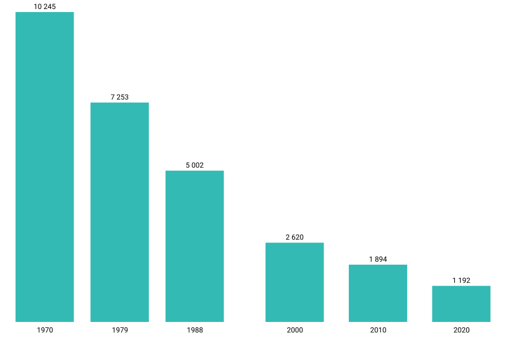

<details>

<summary>ℹ️ Télécharger les données</summary>

<a href="./data-csv/alpes-maritimes-dix-fois-moins-d-exploitations-en-50-and.csv" download style="display: block; margin-top: 0.5rem;"> 📥 Format CSV </a> <a href="./data-svg/alpes-maritimes-dix-fois-moins-d-exploitations-en-50-and.svg" download style="display: block; margin-top: 0.5rem;"> 📥 Format SVG </a> <a href="./data-png/alpes-maritimes-dix-fois-moins-d-exploitations-en-50-and.png" download style="display: block; margin-top: 0.5rem;"> 📥 Format PNG </a>

</details>
:::

::: bubble-white
*Comparaison : indice base 100*

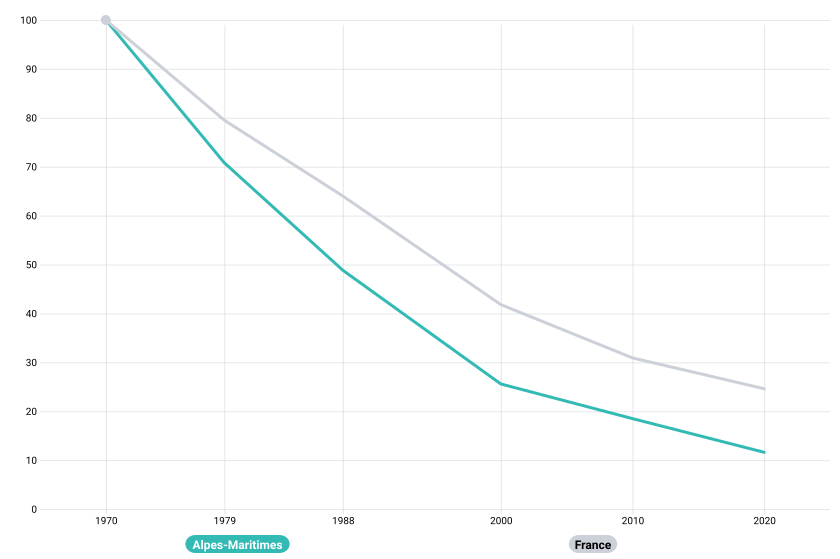{.bulle-blanche}

<details>

<summary>ℹ️ Télécharger les données</summary>

<a href="./data-csv/alpes-maritimes-comparaison-indice-base-100.csv" download style="display: block; margin-top: 0.5rem;"> 📥 Format CSV </a> <a href="./data-svg/alpes-maritimes-comparaison-indice-base-100.svg" download style="display: block; margin-top: 0.5rem;"> 📥 Format SVG </a> <a href="./data-png/aalpes-maritimes-comparaison-indice-base-100.png" download style="display: block; margin-top: 0.5rem;"> 📥 Format PNG </a>

</details>
:::

```{r include=FALSE}
# A modifier pour bien zoomer sur la Guyane
```

En [Guyane]{.highlight-purple}, l’augmentation est continue depuis plusieurs recensements. Il s’agit là d’un cas isolé au sein des départements d’outre-mer, où la tendance est plutôt à la stabilisation du nombre d'exploitations. @cr-carte

```{=html}
<p>
  En <span class="highlight-purple">Guyane</span>, l'augmentation
  <span class="tooltip-container">
    <span class="tooltip-question">?</span>
    <span class="tooltip-content">
      L’immigration (notamment celle des réfugiés politiques Hmong venant du Laos) a contribué à développer l’activité agricole en Guyane.
    </span>
  </span>
    est continue depuis plusieurs recensements.
  <span class="tooltip-container">
    <span class="tooltip-question">?</span>
    <span class="tooltip-content">
      Les recensements agricoles couvrent au même moment les Dom et la métropole à partir de 1988. Dans les Dom, une opération de recensement a eu lieu en 1981.
    </span>
  </span>
  Il s’agit là d’un cas isolé au sein des départements d’outre-mer, où la tendance est plutôt à la stabilisation du nombre d'exploitations.
</p>
```

::: bubble-white
*Guyane : progression continue*

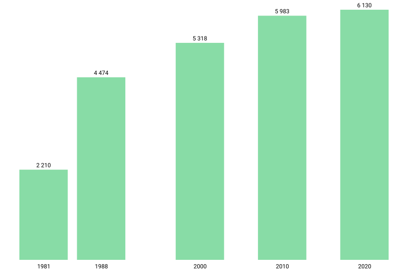

<details>

<summary>ℹ️ Télécharger les données</summary>

<a href="./data-csv/guyane-progression-continue.csv" download style="display: block; margin-top: 0.5rem;"> 📥 Format CSV </a> <a href="./data-svg/guyane-progression-continue.svg" download style="display: block; margin-top: 0.5rem;"> 📥 Format SVG </a> <a href="./data-png/guyane-progression-continue.png" download style="display: block; margin-top: 0.5rem;"> 📥 Format PNG </a>

</details>
:::

::: bubble-white
*Antilles et la Réunion : vers une stabilisation après une forte réduction*

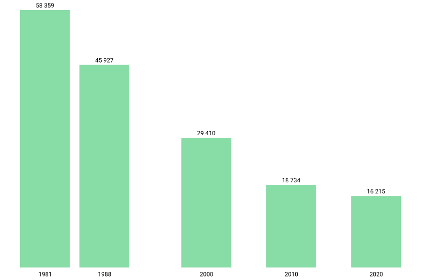

<details>

<summary>ℹ️ Télécharger les données</summary>

<a href="./data-csv/antilles-et-la-reunion-vers-une-stabilisation-apres-une-forte-reduction.csv" download style="display: block; margin-top: 0.5rem;"> 📥 Format CSV </a> <a href="./data-svg/antilles-et-la-reunion-vers-une-stabilisation-apres-une-forte-reduction.svg" download style="display: block; margin-top: 0.5rem;"> 📥 Format SVG </a> <a href="./data-png/antilles-et-la-reunion-vers-une-stabilisation-apres-une-forte-reduction.png" download style="display: block; margin-top: 0.5rem;"> 📥 Format PNG </a>

</details>
:::

En [Corse]{.highlight-green} le nombre d'exploitations se redresse légèrement @cr-carte

::: bubble-white
*Corse : légère augmentation entre 2010 et 2020*

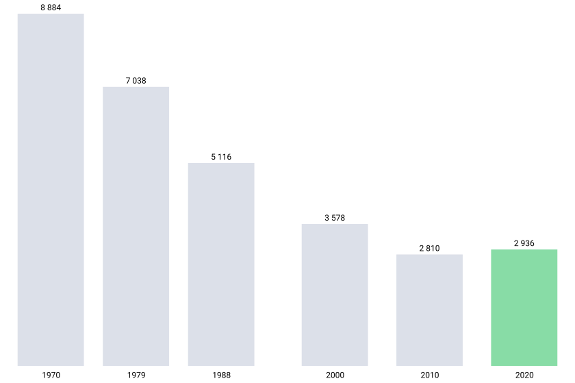

<details>

<summary>ℹ️ Télécharger les données</summary>

<a href="./data-csv/corse-stabilisation-ces-dix-dernieres-annees.csv" download style="display: block; margin-top: 0.5rem;"> 📥 Format CSV </a> <a href="./data-svg/corse-stabilisation-ces-dix-dernieres-annees.svg" download style="display: block; margin-top: 0.5rem;"> 📥 Format SVG </a> <a href="./data-png/corse-stabilisation-ces-dix-dernieres-annees.png" download style="display: block; margin-top: 0.5rem;"> 📥 Format PNG </a>

</details>
:::

::: bubble-white
*Comparaison : indice base 100*

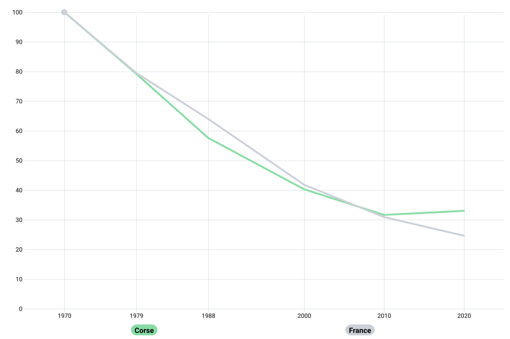

<details>

<summary>ℹ️ Télécharger les données</summary>

<a href="./data-csv/corse-comparaison-indice-base-100.csv" download style="display: block; margin-top: 0.5rem;"> 📥 Format CSV </a> <a href="./data-svg/corse-comparaison-indice-base-100.svg" download style="display: block; margin-top: 0.5rem;"> 📥 Format SVG </a> <a href="./data-png/corse-comparaison-indice-base-100.png" download style="display: block; margin-top: 0.5rem;"> 📥 Format PNG </a>

</details>
:::

Le profil du département de la [Marne]{.highlight-purple} est atypique : le nombre d'exploitations est quasi stable depuis 50 ans @cr-carte

::: bubble-white
*Marne : seulement 20 % d'exploitations en moins en 50 ans*

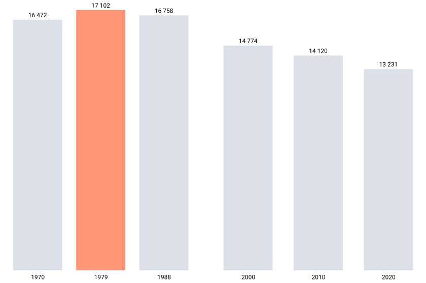

<details>

<summary>ℹ️ Télécharger les données</summary>

<a href="./data-csv/marne-seulement-20-d-exploitations-en-moins-en-50-ans.csv" download style="display: block; margin-top: 0.5rem;"> 📥 Format CSV </a> <a href="./data-svg/marne-seulement-20-d-exploitations-en-moins-en-50-ans.svg" download style="display: block; margin-top: 0.5rem;"> 📥 Format SVG </a> <a href="./data-png/marne-seulement-20-d-exploitations-en-moins-en-50-ans.png" download style="display: block; margin-top: 0.5rem;"> 📥 Format PNG </a>

</details>
:::

::: bubble-white
*Comparaison : indice base 100*

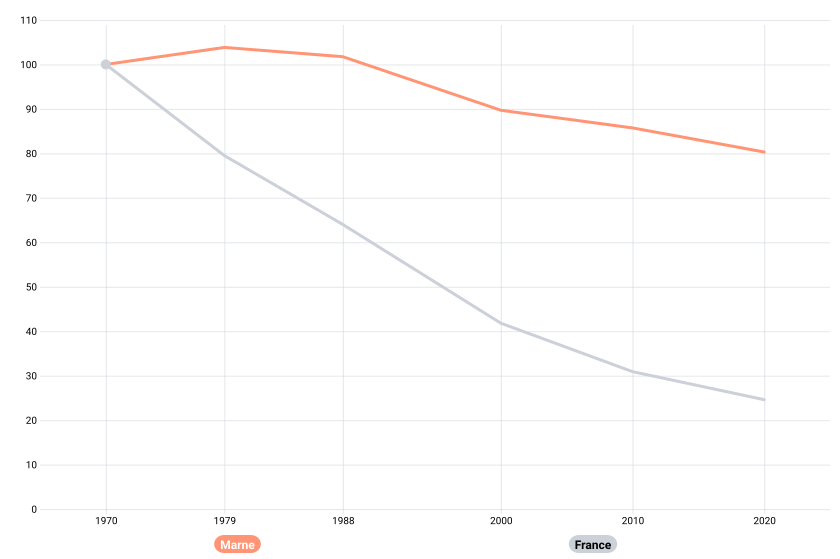

<details>

<summary>ℹ️ Télécharger les données</summary>

<a href="./data-csv/marne-comparaison-indice-base-100.csv" download style="display: block; margin-top: 0.5rem;"> 📥 Format CSV </a> <a href="./data-svg/marne-comparaison-indice-base-100.svg" download style="display: block; margin-top: 0.5rem;"> 📥 Format SVG </a> <a href="./data-png/marne-comparaison-indice-base-100.png" download style="display: block; margin-top: 0.5rem;"> 📥 Format PNG </a>

</details>
:::

Dans cette terre de champagne, on compte en 2020 9 300 exploitations viticoles, soit 70 % de l’ensemble. Elles occupent pour la plupart moins de 20 ha. C’était déjà le cas en 1970. @cr-carte

::: bubble-white
Cette stabilité explique que la Marne soit devenue en 2020 le 1er département de France en nombre d’exploitations, alors qu’il n’était que le 45e il y a 50 ans !
:::
:::::::::::::::

# **Le top 6 des départements en 2020**

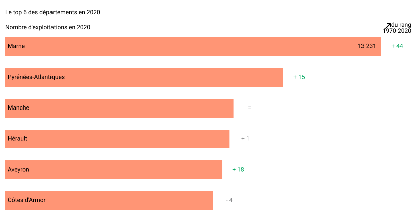

<details>

<summary>ℹ️ Télécharger les données</summary>

<a href="./data-csv/le-top-6-des-departements-en-2020.csv" download style="display: block; margin-top: 0.5rem;"> 📥 Format CSV </a> <a href="./data-svg/le-top-6-des-departements-en-2020.svg" download style="display: block; margin-top: 0.5rem;"> 📥 Format SVG </a> <a href="./data-png/le-top-6-des-departements-en-2020.png" download style="display: block; margin-top: 0.5rem;"> 📥 Format PNG </a>

</details>

::::: {.cr-section .reframe-2-2}
::: {#cr-nb-exp1}
**1970**

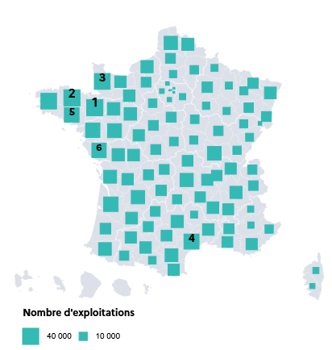

<a href="./data-png/nb-exp1970" download style="display: block; margin-top: 0.5rem;"> 📥 Télécharger l’image </a>
:::

::: {#cr-nb-exp2}
**2020**

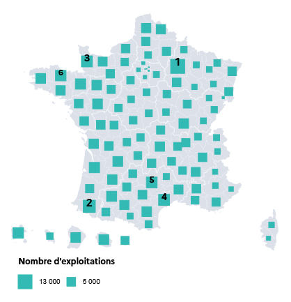

<a href="./data-png/nb-exp2020" download style="display: block; margin-top: 0.5rem;"> 📥 Télécharger l’image </a>
:::

Il y a 50 ans, c'est la Bretagne et ses proches voisins qui marquaient la tête du classement. @cr-nb-exp1

En 2020, la distribution géographique des exploitations est assez proche, bien qu’un peu plus homogène, avec en particulier l’apparition de la Marne, des Pyrénées-Atlantiques et de l’Aveyron parmi les 6 premiers départements. @cr-nb-exp2
:::::

::: {.fin-page .align-center}
**Pour en savoir plus sur le sujet :**

<a href="https://agreste.agriculture.gouv.fr/agreste-web/" style="display: block; margin-top: 0.5rem;"> 🐮 Site Agreste 🐮 </a>

**Pour aller voir d'autres DataViz :**

<a href="https://vizagreste.agriculture.gouv.fr/" style="display: block; margin-top: 0.5rem;"> 📉 Accueil VizAgreste 📉 </a>
:::
